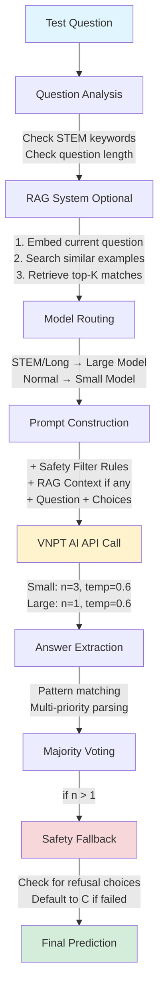

# VNPT AI Hackathon - Hệ thống Giải Trắc Nghiệm Tự Động

Dự án xây dựng hệ thống AI tự động giải các câu hỏi trắc nghiệm kiến thức tổng hợp, sử dụng kỹ thuật RAG (Retrieval-Augmented Generation) kết hợp với phương pháp học lặp (Iterative Learning) để cải thiện độ chính xác qua các lần nộp bài.

---

## Pipeline Flow


---

## Data Processing - Phương Pháp Học Lặp (Iterative Learning)

Hệ thống sử dụng phương pháp **"Học theo đợt"** để cải thiện độ chính xác dần qua mỗi lần nộp bài:

### Quy Trình:

```
┌──────────────┐      ┌──────────────┐      ┌──────────────┐
│   Đợt 1      │      │   Đợt 2      │      │   Đợt 3      │
│              │      │              │      │              │
│ Nộp bài lần  │─────▶│ Nhận kết quả │─────▶│ Tạo RAG từ   │
│ đầu (no RAG) │      │ từ platform  │      │ câu trả lời  │
│              │      │              │      │ đúng         │
└──────────────┘      └──────────────┘      └──────┬───────┘
                                                    │
                                                    ▼
┌──────────────┐      ┌──────────────┐      ┌──────────────┐
│   Đợt 6      │      │   Đợt 5      │      │   Đợt 4      │
│              │      │              │      │              │
│ Độ chính xác │◀─────│ Lặp lại quy  │◀─────│ Nộp bài với  │
│ tối ưu       │      │ trình cải    │      │ RAG mới      │
│              │      │ thiện        │      │              │
└──────────────┘      └──────────────┘      └──────────────┘
```

### Chi Tiết Các Bước:

1. **Nộp Submission Ban Đầu**:
   - Chạy `predict.py` không dùng RAG hoặc với RAG từ val.json
   - Nộp `submission.csv` lên platform
   - Nhận điểm số và file kết quả

2. **Thu Thập Dữ Liệu Tốt**:
   - Lấy submission có kết quả cao nhất
   - Lưu vào `data/test_ans.json` với format:
     ```json
     [
       {"qid": "123", "question": "...", "answer": "A", "choices": [...]}
     ]
     ```

3. **Tạo Embeddings Mới**:
   - Chạy `prepare_assets.py` để tạo embeddings cho:
     - `data/val.json` (validation set)
     - `data/test_ans.json` (đáp án của submission có kết quả cao nhất, theo format của val)
   - Lưu vào `assets/val_embeddings.json`

4. **Nộp Lại Với RAG Cải Thiện**:
   - Chạy `predict.py --rag` để dùng RAG
   - Hệ thống sẽ tìm các câu hỏi tương tự từ cơ sở dữ liệu đã mở rộng
   - Kết quả dự kiến tốt hơn do có thêm context từ test set

5. **Lặp Lại**:
   - Tiếp tục quy trình cho đến khi đạt độ chính xác mong muốn

### Ưu điểm:
- Tận dụng kết quả từ các lần nộp trước
- Mở rộng dần cơ sở tri thức RAG
- Cải thiện độ chính xác dần qua mỗi iteration
- Không cần dataset huấn luyện lớn ban đầu

---

## Resource Initialization

### 1. Cấu Trúc Thư Mục

```
self_vnpt_hackathon/
│
├── data/                      # Dữ liệu
│   ├── val.json              # Validation set (có ground truth)
│   ├── test.json             # Test set (không có đáp án)
│   └── test_ans.json         # Submission tốt nhất trong các lần nộp trước
│
├── assets/                    # Tài nguyên đã xử lý
│   └── val_embeddings.json   # Vector embeddings cho RAG
│
├── utils/                     # Utilities
│   ├── __init__.py
│   └── api_client.py         # VNPT AI API Client
│
├── predict.py                 # Script dự đoán chính
├── evaluate_dev.py            # Script đánh giá trên val set
├── prepare_assets.py          # Script tạo embeddings
├── api-keys.json             # API keys (KHÔNG commit lên git)
├── requirements.txt           # Dependencies
└── README.md                  # File này
```

### 2. Cài Đặt Dependencies

```bash
pip install -r requirements.txt
```

### 3. Cấu Hình API Keys

Tạo file `api-keys.json` với nội dung:

```json
[
  {
    "llmApiName": "vnptai-hackathon-small",
    "authorization": "Bearer YOUR_TOKEN",
    "tokenId": "YOUR_TOKEN_ID",
    "tokenKey": "YOUR_TOKEN_KEY"
  },
  {
    "llmApiName": "vnptai-hackathon-large",
    "authorization": "Bearer YOUR_TOKEN",
    "tokenId": "YOUR_TOKEN_ID",
    "tokenKey": "YOUR_TOKEN_KEY"
  },
  {
    "llmApiName": "vnptai-hackathon-embedding",
    "authorization": "Bearer YOUR_TOKEN",
    "tokenId": "YOUR_TOKEN_ID",
    "tokenKey": "YOUR_TOKEN_KEY"
  }
]
```

**Lưu ý**: Thêm `api-keys.json` vào `.gitignore` để bảo mật

### 4. Khởi Tạo Vector Database (RAG)

```bash
# Bước 1: Tạo embeddings cho validation set và test answers
python prepare_assets.py

# Output: assets/val_embeddings.json
```

Script này sẽ:
- Đọc `data/val.json` và `data/test_ans.json`
- Gọi VNPT Embedding API cho từng câu hỏi
- Lưu vectors vào `assets/val_embeddings.json`

---

## Usage

### Dự Đoán Test Set

```bash
# Không dùng RAG (lần đầu tiên)
python predict.py

# Dùng RAG (sau khi đã có embeddings)
python predict.py --rag

# Giới hạn số câu hỏi (để test) (0 để không giới hạn)
python predict.py --rag --limit 10

# Dự đoán một câu hỏi cụ thể
python predict.py --rag --id "test_0001"
```

**Output**: `submission.csv`

### Đánh Giá Trên Validation Set

```bash
# Đánh giá với RAG
python evaluate_dev.py

# Đánh giá không dùng RAG
python evaluate_dev.py --no-rag

# Giới hạn số câu
python evaluate_dev.py --limit 50
```

**Output**:
- `evaluation_report.csv` - Báo cáo chi tiết từng câu
- `evaluation_failures.csv` - Chỉ các câu trả lời sai
- Console: Accuracy score

---

## Architecture Details

### Model Routing Strategy

```python
if có_từ_khóa_STEM or len(question) > 1800:
    → Large Model (n=1, temp=0.6)
else:
    → Small Model (n=3, temp=0.6, majority voting)
```

**STEM Keywords**: `$`, `\`, `tính toán`, `cm`, `kg`, `hàm số`, `dao động`, `lợi nhuận`, `tỷ suất`, `doanh số`

### Safety Filter

Hệ thống có cơ chế phát hiện và từ chối trả lời các câu hỏi nhạy cảm:
- Câu hỏi về hành vi vi phạm pháp luật
- Câu hỏi về lừa đảo, làm giả
- Câu hỏi xúc phạm lãnh tụ/chính quyền
Khi đó, model từ chối trả lời và không trả về kết quả
Khi phát hiện điều đó, hệ thống sẽ chọn đáp án có nội dung từ chối (ví dụ: "Tôi không thể trả lời...")

### Quota Management

API có giới hạn:
- Small Model: 60 requests/hour
- Large Model: 40 requests/hour

Hệ thống tự động:
- Theo dõi số lượng request đã dùng
- Sleep đến giờ tiếp theo khi hết quota
- Lưu trạng thái vào `api_usage.json`

### Answer Extraction Priorities

1. **End of line**: "đáp án A."
2. **Start of line**: "A. Content..."
3. **Standalone letter**: "A"
4. **Multi-line pattern**: "đáp án:\nA"
5. **Last capital letter**: Tìm chữ in hoa cuối cùng

---

## Tối ưu hóa hiệu suất

3. **Smart Routing**: Dùng small model cho câu đơn giản
4. **Majority Voting**: n=3 cho small model để tăng độ chính xác
5. **Iterative Learning**: Tận dụng kết quả từ các lần nộp trước

---

### Lỗi thường gặp

**API 401 Error**:
- Kiểm tra `api-keys.json` có đúng format không
- Verify token còn hiệu lực

**No embeddings found**:
- Chạy `python prepare_assets.py` trước
- Kiểm tra `assets/val_embeddings.json` đã được tạo chưa

---

## Notes

- Hệ thống sử dụng UTF-8 encoding cho tiếng Việt
- Tất cả log files sử dụng encoding UTF-8
---

**Phát triển bởi**: Team VNPT AI Hackathon  
**Phiên bản**: 1.0  
**Cập nhật**: December 2025
